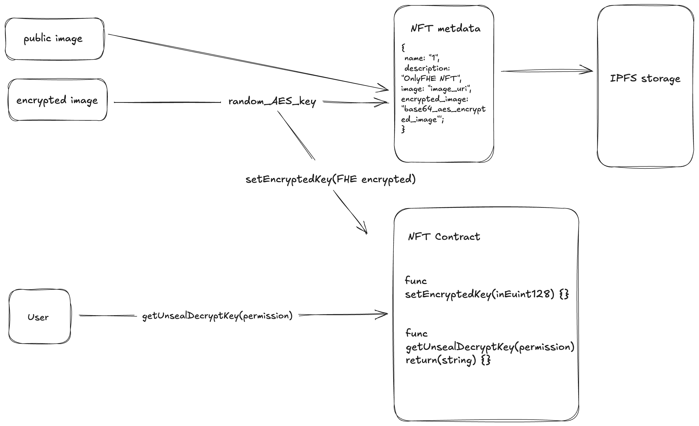

# Only-FHE

## This repo is dedicated to the ethglobal online hackathon

This project provide NFT ability to hold a hidden metadata. 
1. Beside the public image URI. NFT can hold a private image. 
2. The image most significant be can be extract (assume it is lower than 256bit) and encrypted by using FHE technology. The encrypted bits finally saved onchain in the nft contract. Only the owner of the NFT can get the real bit and the reproduce the private image.
3. Furthermore, the image metadata can also be FHE encrypted. It is allow those value also keep privately onchain, and can be updated without revealing value. This features can be apply to gaming. For example, the power of a pokemon. It can be evolved and increase power without the notice of other user before a match.
4. User from platform like OnlyFans, can also take advantage of this, by selling NFT, with the public image is the censored version, while the encrypted one is the uncensored version which the buyer would like to own.



**Contract**
1. *localfhenix (exposed)*: 0x7a69d10828D9bf695ceEb007663b9ead8ab23834
2. *Helium testnet*: 0xACadC9298bB39a24348eaD6b08EE45bb03267327

## Quick start

The first things you need to do are cloning this repository and installing its dependencies:

```sh
git clone https://github.com/halink0803/only-fhe.git
cd only-fhe
pnpm install
```

Next, you need an .env file containing your mnemonics or keys. You can use .env.example that comes with a predefined mnemonic, or use your own

```sh
cp .env.example .env
```

Once the file exists, let's run a LocalFhenix instance:

```sh
pnpm localfhenix:start
```

This will start a LocalFhenix instance in a docker container. If this worked you should see a `Started LocalFhenix successfully` message in your console.

If not, please make sure you have `docker` installed and running on your machine. You can find instructions on how to install docker [here](https://docs.docker.com/get-docker/).

Now that we have a LocalFhenix instance running, we can deploy our contracts to it:

```sh
npx hardhat deploy
```


```sh
```

## Troubleshooting


## More Info

